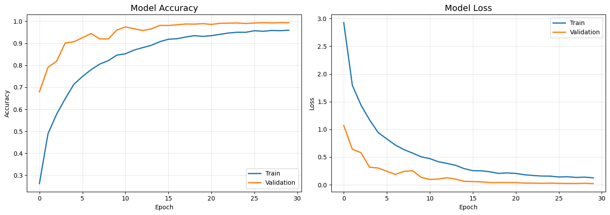
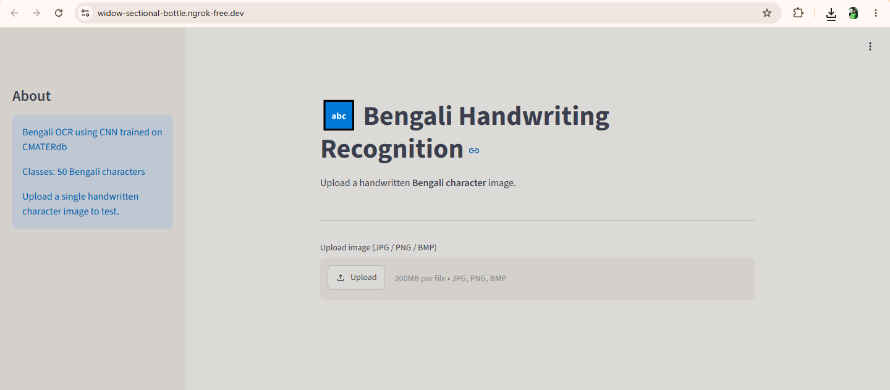
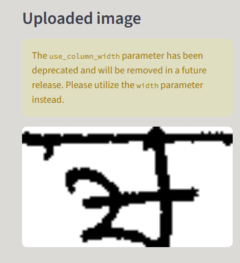
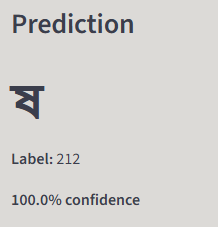
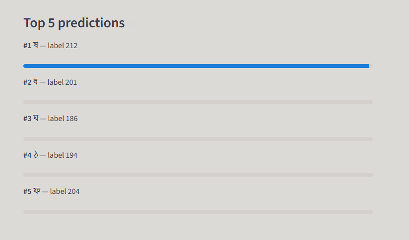

# Bengali Handwriting Recognition System

A Deep Learning based OCR system for recognizing Bengali handwritten characters.

## Features

- Bengali Character Recognition
- CNN-based Classification
- Streamlit Web Interface
- Top-5 Prediction Display
- Confidence Scores

## Technologies Used

- Python
- TensorFlow
- OpenCV
- Streamlit
- NumPy

## Dataset

CMATERdb Bengali Character Dataset

## Project Workflow

Image Upload
→ Preprocessing
→ CNN Model
→ Character Prediction
→ Bengali Unicode Output

## Accuracy

Validation Accuracy: 95.9%

## Screenshots

### Training Curves

### Streamlit Home Page

### Uploaded Image

### Prediction Result

### Top 5 Predictions

## Model available on request (since file size is larger).

## Author

Shinjini Saha
